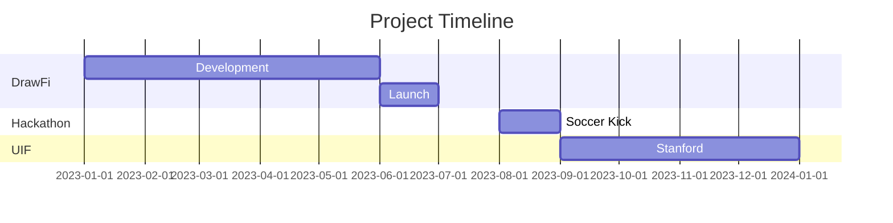

# Chretien Banza &nbsp;|&nbsp; Data-Driven Developer

<div align="center">


`Innovation` • `Full Stack Development` • `Machine Learning` • `Data Science`

[](https://github.com/Chretienb)
[](https://chretienb.github.io/)
[](https://www.linkedin.com/in/chretien-banza-042831242)

</div>

## Analytics Dashboard

<div align="center" style="display: grid; grid-template-columns: repeat(2, 1fr); gap: 20px;">

| Metric | Value |
|:--|:--|
| 🚀 Projects Launched | 4 |
| 💻 Technologies | 12+ |
| 🎵 Instruments | 5+ |
| 🌟 GitHub Stars | Growing |

</div>

```python
# Tech Stack Overview
class ChretienBanza:
    def __init__(self):
        self.languages = {
            'primary': ['Python', 'Dart', 'JavaScript'],
            'learning': ['Rust', 'Go']
        }
        self.expertise = {
            'data_science': ['Machine Learning', 'Data Analysis', 'Visualization'],
            'development': ['Full Stack', 'Mobile', 'Cloud'],
            'tools': ['Docker', 'Git', 'CI/CD']
        }
        self.current_focus = 'Fintech Innovation'
```

## Project Portfolio

<div style="display: grid; grid-template-columns: repeat(2, 1fr); gap: 20px;">

### 📊 DrawFi


Revolutionizing construction loan management with ML-powered analytics and automated draw processing.

### 🛠️ wrkbnch


Smart operations platform for contractors featuring predictive scheduling and resource optimization.

### 📱 SmartyKids


Educational platform using gamification and AI to personalize learning experiences.

### 🎵 SoundGrid


Next-gen music collaboration platform with real-time audio processing.

</div>

## Development Metrics

<div align="center">


</div>

## Recent Achievements



## Current Stack

<div align="center" style="background: #0D1117; padding: 20px; border-radius: 10px;">

| Category | Technologies |
|:--|:--|
| **Frontend** |   |
| **Backend** |   |
| **Database** |   |
| **Cloud** |   |

</div>

## 🎵 Now Playing

<div align="center">

[](https://github.com/kittinan/spotify-github-profile)

</div>

---

<div align="center">

[](https://github.com/Chretienb)

</div>
